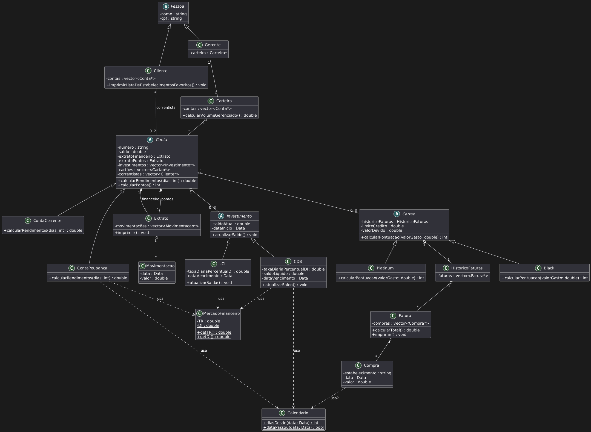

# Prova - Sistema Bancário Modular

Projeto de sistema bancário em C++ com arquitetura modularizada.

## Estrutura do Projeto

```
prova/
├── include/              # Headers dos módulos
│   ├── calendario.h      # Data, Calendario, MercadoFinanceiro
│   ├── console.h         # Interface de console
│   ├── extrato.h         # Movimentações e extratos
│   ├── compra.h          # Compras, faturas
│   ├── investimento.h    # CDB, LCI
│   ├── cartao.h          # Cartões Black, Platinum
│   ├── conta.h           # Contas corrente e poupança
│   ├── pessoa.h          # Pessoas, clientes, gerentes
│   └── carteira.h        # Carteira de investimentos
├── src/                  # Implementações (.cpp)
├── main.cpp              # Função main e demo
├── Makefile              # Build automatizado
└── bin/                  # Binários gerados
```

## Requisitos

- **Compilador:** g++ com suporte a C++17
- **Sistema:** Linux/Unix (ou WSL no Windows)

## Build e Execução

### Opção 1: Usando Makefile (Recomendado)

```bash
# Build
make

# Executar
make run

# Limpar objetos
make clean
```

### Opção 2: Compilação manual

```bash
g++ -std=c++17 -I include main.cpp src/*.cpp -o bin/main
./bin/main
```

## Módulos

| Módulo | Responsabilidade |
|--------|------------------|
| **calendario** | Data, conversão de tempo, índices financeiros (DI, TR) |
| **console** | Formatação de output (cores, tabelas, moeda) |
| **extrato** | Movimentações e extratos financeiros |
| **compra** | Compras, faturas e histórico |
| **investimento** | CDB, LCI com cálculo de rendimentos |
| **cartao** | Cartões de crédito (Black, Platinum) e pontuação |
| **conta** | Contas corrente e poupança |
| **pessoa** | Clientes e gerentes |
| **carteira** | Gerenciamento de carteira e volume |

## Exemplo de Uso

```cpp
// Criar cliente
auto cliente = make_shared<ClienteShared>("Thiago", "000.000.000-00");

// Criar conta
auto conta = make_shared<ContaPoupanca>("0001");
conta->saldo = 1000.0;
cliente->adicionarContaSafe(conta);

// Adicionar cartão e compras
auto cartao = make_shared<Black>();
auto fatura = make_shared<Fatura>();
fatura->adicionarCompra(make_shared<Compra>("Loja X", Data(2025,11,1), 100.0));
cartao->historico.adicionarFatura(fatura);
conta->cartoes.push_back(cartao);
```

## Diagrama UML

Veja `diagrama.puml` para a representação UML do projeto.



